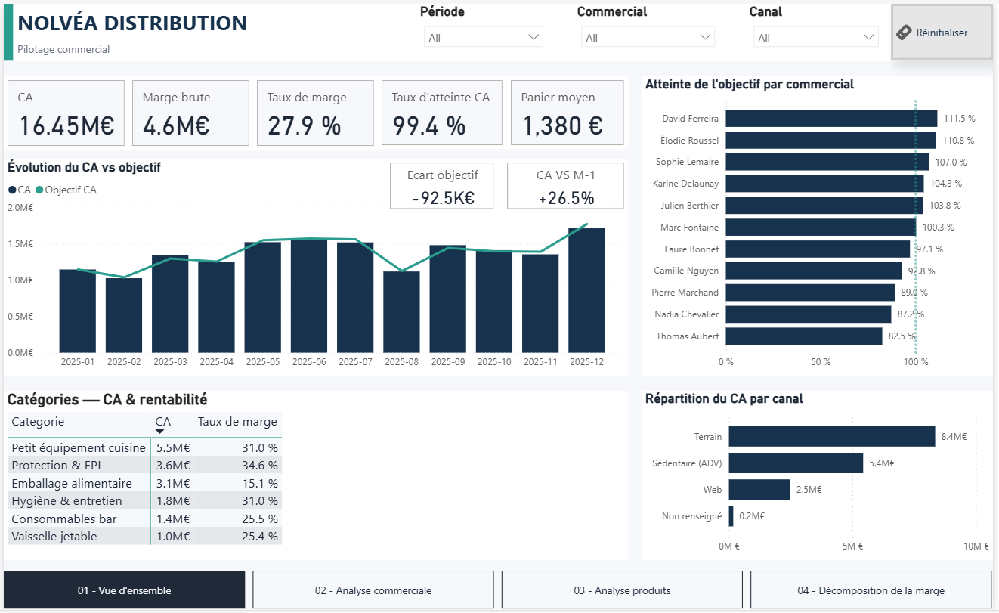
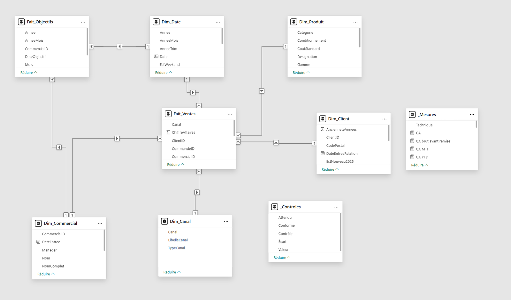
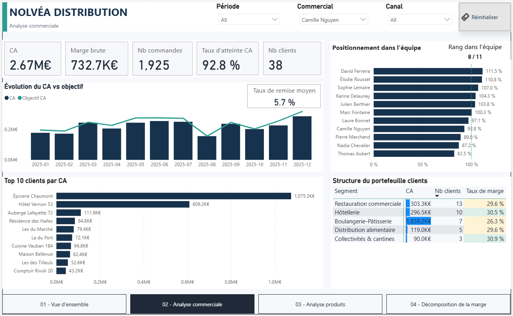
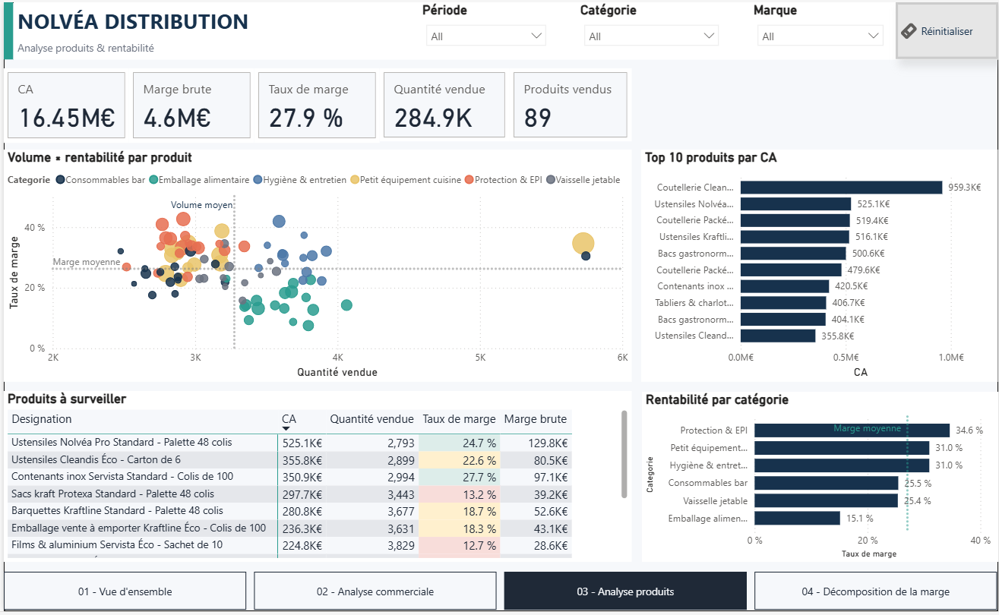
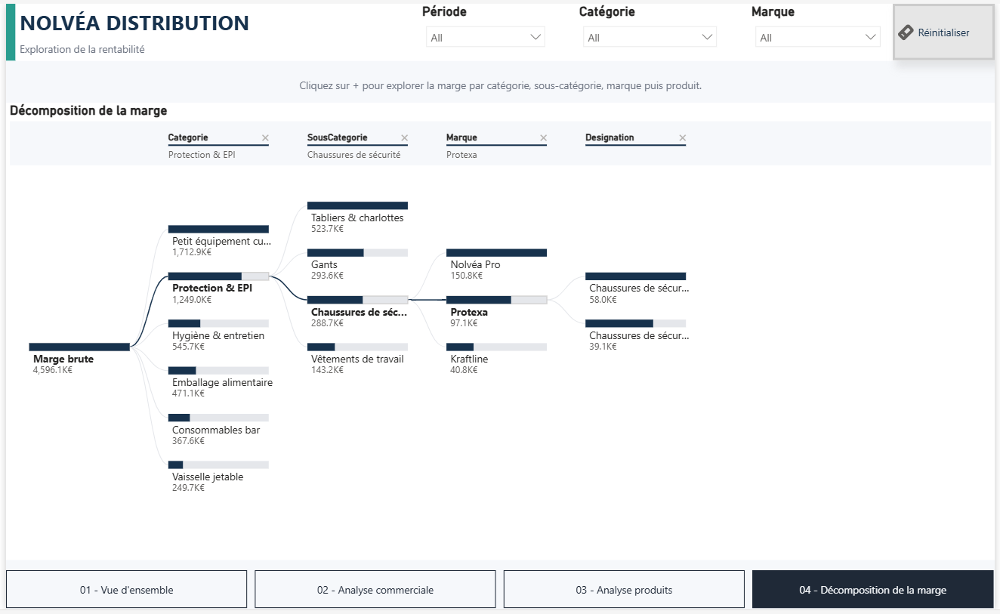

# Nolvéa Distribution — Power BI Case Study

Cas d’étude personnel de Business Intelligence consacré à la transformation d’un reporting commercial manuel en solution Power BI automatisée, fiabilisée et interactive.

🌐 **Étude de cas complète :**  
https://moustapha-djite.netlify.app/projects/nolvea

> **Projet portfolio fictif** — l’entreprise et les données sont entièrement synthétiques et ont été conçues pour reproduire un contexte réaliste de reporting commercial B2B.

*Vue d'ensemble — performance commerciale, objectifs, catégories et canaux.*
---

## Le contexte

Nolvéa Distribution simule une entreprise B2B disposant d’un reporting commercial alimenté chaque mois par des exports ERP.

Le processus initial repose sur des manipulations manuelles : consolidation des fichiers, nettoyage des données, harmonisation des libellés, calcul des indicateurs puis mise à jour du reporting.

Le cas d’étude introduit également un changement d’ERP en cours d’année, avec deux structures de fichiers différentes à absorber dans une même chaîne de préparation.

---

## Chiffres clés

| Indicateur | Valeur |
|---|---:|
| Fichiers mensuels consolidés | 12 |
| Formats ERP harmonisés | 2 |
| Lignes brutes | 37 879 |
| Lignes après fiabilisation | 37 864 |
| Pages Power BI | 4 |
| Préparation mensuelle — scénario initial | ≈ 11 h |
| Préparation mensuelle — scénario cible | ≈ 15 min |

Le gain de temps présenté correspond au **scénario métier construit pour le cas d’étude** et non à une mesure réalisée chez un client réel.

---

## Problématiques traitées

Le projet couvre plusieurs problématiques classiques de reporting :

- consolidation automatique de fichiers mensuels ;
- changement de structure des exports après migration ERP ;
- homogénéisation des types de données ;
- normalisation des clés clients ;
- suppression des doublons ;
- harmonisation des libellés de canaux ;
- contrôle de la qualité des données ;
- modélisation analytique ;
- création d’indicateurs DAX ;
- restitution interactive pour le pilotage commercial.

---

## Préparation et qualité des données

La chaîne Power Query absorbe les différents formats ERP et applique les transformations nécessaires avant chargement dans le modèle.

Quelques anomalies identifiées dans le jeu de données :

- **15 lignes dupliquées** supprimées ;
- les doublons auraient surévalué le chiffre d’affaires de **7 513 €** ;
- **1 966 lignes**, soit environ **5,2 %**, présentaient un risque de non-correspondance client avant normalisation des clés ;
- **8 libellés de canaux** ont été harmonisés vers **3 canaux métier**.

---

## Modèle de données

Le modèle repose sur une architecture analytique proche d’un schéma en étoile.

Principales tables :

### Tables de faits

- `Fait_Ventes`
- `Fait_Objectifs`

### Dimensions

- `Dim_Date`
- `Dim_Commercial`
- `Dim_Client`
- `Dim_Produit`
- `Dim_Canal`

### Tables techniques

- `_Mesures`
- `_Controles`

Les mesures métier sont centralisées dans `_Mesures` afin de séparer les calculs DAX des tables de données.

*Modèle analytique avec tables de faits, dimensions et tables techniques dédiées aux mesures et contrôles.*
---

## Quelques indicateurs DAX

Le rapport inclut notamment :

- chiffre d’affaires ;
- marge brute ;
- taux de marge ;
- panier moyen ;
- nombre de commandes ;
- objectif de chiffre d’affaires ;
- écart à l’objectif ;
- évolution du CA vs M-1 ;
- taux d’atteinte commercial ;
- taux de remise pondéré ;
- classements commerciaux ;
- indicateurs de surveillance produit.
➡️ **Voir une sélection commentée de mesures DAX :** [dax/measures.md](dax/measures.md)
---

## Le dashboard

Le rapport Power BI est structuré en quatre pages métier.

### 01 — Vue d’ensemble

Synthèse des principaux KPI commerciaux :

- chiffre d’affaires ;
- marge ;
- taux de marge ;
- atteinte des objectifs ;
- évolution mensuelle ;
- performance par commercial ;
- répartition par catégorie et canal.

### 02 — Analyse commerciale

Exploration de la performance des commerciaux et de leur portefeuille clients :

- chiffre d’affaires ;
- marge ;
- nombre de commandes ;
- classement ;
- taux de remise ;
- top clients ;
- analyse par segment.

### 03 — Analyse produits

Analyse croisée du volume, du chiffre d’affaires et de la rentabilité :

- produits les plus contributeurs ;
- rentabilité par catégorie ;
- volume × marge ;
- identification de produits à surveiller.

### 04 — Décomposition de la marge

Arbre de décomposition permettant de naviguer progressivement :

**catégorie → sous-catégorie → marque → produit**

pour comprendre les principaux contributeurs à la marge.

---

## Exemples d’insights

Le dashboard permet notamment de constater que :

- l’atteinte globale de l’objectif CA atteint environ **99,4 %** ;
- la performance commerciale présente une dispersion importante entre commerciaux ;
- certaines catégories affichent un chiffre d’affaires élevé mais une rentabilité nettement inférieure à la moyenne ;
- les catégories **Petit équipement cuisine** et **Protection & EPI** représentent ensemble une part majeure de la marge brute ;
- certains produits génèrent un chiffre d’affaires significatif avec un taux de marge proche de **12–13 %**, contre environ **27,9 %** au global.

Ces constats servent de points de départ à l’analyse ; aucune causalité n’est déduite automatiquement du dashboard.

---

## Stack

- Power BI Desktop
- Power Query / M
- DAX
- Data Modeling
- Data Quality
- Excel

---

## Compétences démontrées

Ce projet illustre une chaîne BI complète :

**sources brutes → préparation → qualité → modélisation → KPI → visualisation → analyse métier**

Il met notamment en pratique :

- consolidation multi-fichiers ;
- transformation Power Query ;
- contrôle qualité ;
- modélisation dimensionnelle ;
- développement DAX ;
- design de dashboard ;
- analyse commerciale et de rentabilité.

---

## Voir le projet

🌐 **Case study complet :**  
https://moustapha-djite.netlify.app/projects/nolvea

👤 **Portfolio :**  
https://moustapha-djite.netlify.app
