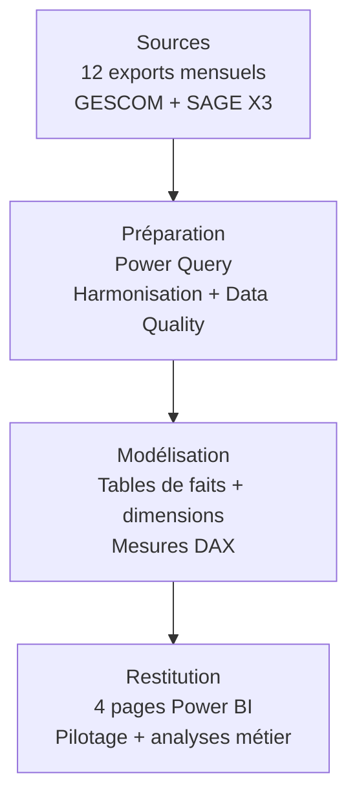

# Architecture analytique — Nolvéa Distribution

Cette page présente l’architecture générale du cas d’étude Nolvéa Distribution, depuis les exports ERP jusqu’à la restitution Power BI.

> **Projet portfolio fictif** — l’entreprise et les données sont entièrement synthétiques.

---

## Vue d’ensemble

La chaîne a été conçue pour absorber des fichiers mensuels hétérogènes tout en conservant un modèle analytique stable pour la restitution.

---

## 1. Sources

Le reporting est alimenté par **12 exports mensuels de ventes sur l’année 2025**.

Le scénario reproduit un changement d’ERP en cours d’année :

- **GESCOM** de janvier à juin ;
- **SAGE X3** de juillet à décembre.

Les deux systèmes produisent des structures différentes. L’harmonisation est donc réalisée avant l’alimentation du modèle.

Les problématiques de qualité associées sont détaillées dans :

➡️ [Data Quality](data-quality.md)

---

## 2. Préparation avec Power Query

Power Query constitue la couche de préparation.

Les principales opérations sont :

- consolidation des fichiers mensuels ;
- harmonisation des noms de colonnes ;
- conversion et normalisation des types ;
- traitement des dates et nombres importés sous forme de texte ;
- suppression des doublons ;
- normalisation des clés de rapprochement ;
- standardisation des canaux commerciaux ;
- contrôles de cohérence avant chargement.

Le résultat est une structure homogène pouvant alimenter le modèle Power BI indépendamment du format ERP d’origine.

---

## 3. Modèle analytique

Le modèle est organisé autour de deux tables de faits.

### `Fait_Ventes`

Table centrale contenant les transactions commerciales utilisées pour calculer notamment :

- chiffre d’affaires ;
- coûts ;
- marge ;
- quantités ;
- commandes ;
- remises.

Elle est reliée aux principales dimensions analytiques :

- `Dim_Date`
- `Dim_Commercial`
- `Dim_Client`
- `Dim_Produit`
- `Dim_Canal`

### `Fait_Objectifs`

Cette table possède une granularité différente :

**un objectif par commercial et par mois.**

Elle permet de comparer la performance réalisée aux objectifs commerciaux.

Cette granularité est volontairement préservée : les objectifs ne sont pas artificiellement ventilés par client, produit ou canal.

---

## 4. Dimensions

Les dimensions structurent les axes d’analyse du rapport.

### `Dim_Date`

Support de l’analyse temporelle et des comparaisons mensuelles.

### `Dim_Commercial`

Analyse de la performance individuelle et du positionnement dans l’équipe.

### `Dim_Client`

Analyse des portefeuilles clients et des segments.

### `Dim_Produit`

Analyse des références, catégories, sous-catégories et rentabilité produit.

### `Dim_Canal`

Analyse de la répartition des ventes par canal commercial.

---

## 5. Tables techniques

Deux tables sont séparées du modèle métier.

### `_Mesures`

Centralise les mesures DAX afin de ne pas disperser les calculs dans les différentes tables.

Exemples :

- CA ;
- marge brute ;
- taux de marge ;
- comparaisons M-1 ;
- objectifs ;
- ranking commercial ;
- taux de remise pondéré ;
- règles de surveillance produit.

➡️ [Voir une sélection de mesures DAX](../dax/measures.md)

### `_Controles`

Centralise les indicateurs utilisés pour contrôler la cohérence et la qualité des données.

Cette séparation permet de distinguer clairement :

**données métier → calculs analytiques → contrôles techniques.**

---

## 6. Restitution Power BI

Le rapport comporte quatre pages métier.

### 01 — Vue d’ensemble

Pilotage global de la performance commerciale :

- chiffre d’affaires ;
- marge ;
- taux de marge ;
- objectifs ;
- évolution mensuelle ;
- performance des commerciaux ;
- catégories ;
- canaux.

### 02 — Analyse commerciale

Analyse des commerciaux et de leur portefeuille clients.

### 03 — Analyse produits

Analyse croisée du volume, du chiffre d’affaires et de la rentabilité.

### 04 — Décomposition de la marge

Exploration progressive de la marge selon :

**catégorie → sous-catégorie → marque → produit**

---

## Principes retenus

L’architecture repose sur quelques principes simples :

1. traiter les différences de sources avant le modèle ;
2. isoler les règles de qualité ;
3. conserver la granularité propre à chaque table de faits ;
4. privilégier un modèle dimensionnel lisible ;
5. centraliser les mesures DAX ;
6. séparer préparation, modélisation et restitution.

L’objectif est de rendre le reporting plus robuste face à l’évolution des fichiers sources tout en conservant une couche analytique compréhensible et maintenable.